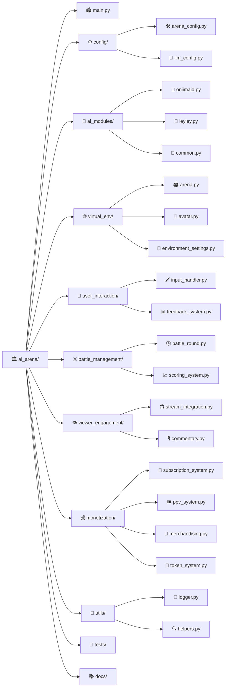

# AI ARENA

```mermaid

flowchart LR;

    A["🏛️ ai_arena/"] --> B["🏟️ main.py"];
    A --> C["⚙️ config/"];
    C --> D["🛠️ arena_config.py"];
    C --> E["🔧 llm_config.py"];

    A --> F["🧠 ai_modules/"];
    F --> G["🤖 oniimaid.py"];
    F --> H["👾 leyley.py"];
    F --> I["🤗 common.py"];

    A --> J["🌐 virtual_env/"];
    J --> K["🏟️ arena.py"];
    J --> L["🧑 avatar.py"];
    J --> M["🌿 environment_settings.py"];

    A --> N["👥 user_interaction/"];
    N --> O["🖊️ input_handler.py"];
    N --> P["📊 feedback_system.py"];

    A --> Q["⚔️ battle_management/"];
    Q --> R["🕒 battle_round.py"];
    Q --> S["📈 scoring_system.py"];

    A --> T["👁️ viewer_engagement/"];
    T --> U["📺 stream_integration.py"];
    T --> V["🎙️ commentary.py"];

    A --> W["💰 monetization/"];
    W --> X["🔐 subscription_system.py"];
    W --> Y["🎟️ ppv_system.py"];
    W --> Z["👕 merchandising.py"];
    W --> AA["🏧 token_system.py"];

    A --> AC["🔧 utils/"];
    AC --> AD["📝 logger.py"];
    AC --> AE["🔍 helpers.py"];

    A --> AF["🧪 tests/"];
    A --> AG["📚 docs/"];

```
