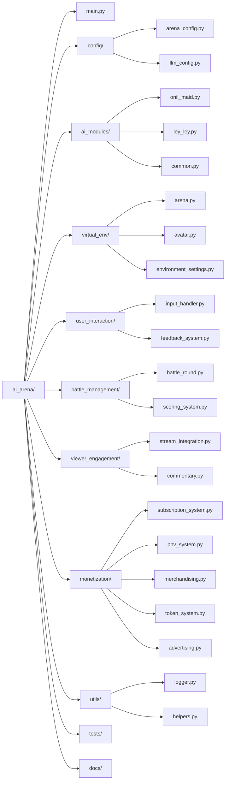

# AI ARENA

```mermaid
flowchart LR;

    A["ai_arena/"] --> B["main.py"];
    A --> C["config/"];
    C --> D["arena_config.py"];
    C --> E["llm_config.py"];

    A --> F["ai_modules/"];
    F --> G["onii_maid.py"];
    F --> H["ley_ley.py"];
    F --> I["common.py"];

    A --> J["virtual_env/"];
    J --> K["arena.py"];
    J --> L["avatar.py"];
    J --> M["environment_settings.py"];

    A --> N["user_interaction/"];
    N --> O["input_handler.py"];
    N --> P["feedback_system.py"];

    A --> Q["battle_management/"];
    Q --> R["battle_round.py"];
    Q --> S["scoring_system.py"];

    A --> T["viewer_engagement/"];
    T --> U["stream_integration.py"];
    T --> V["commentary.py"];

    A --> W["monetization/"];
    W --> X["subscription_system.py"];
    W --> Y["ppv_system.py"];
    W --> Z["merchandising.py"];
    W --> AA["token_system.py"];
    W --> AB["advertising.py"];

    A --> AC["utils/"];
    AC --> AD["logger.py"];
    AC --> AE["helpers.py"];

    A --> AF["tests/"];
    A --> AG["docs/"];

```
